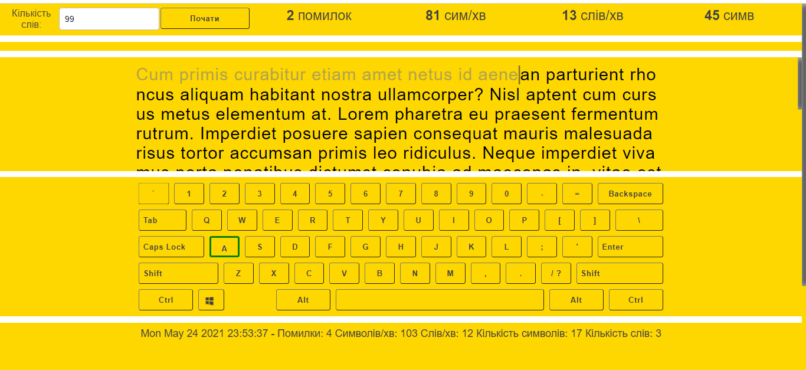
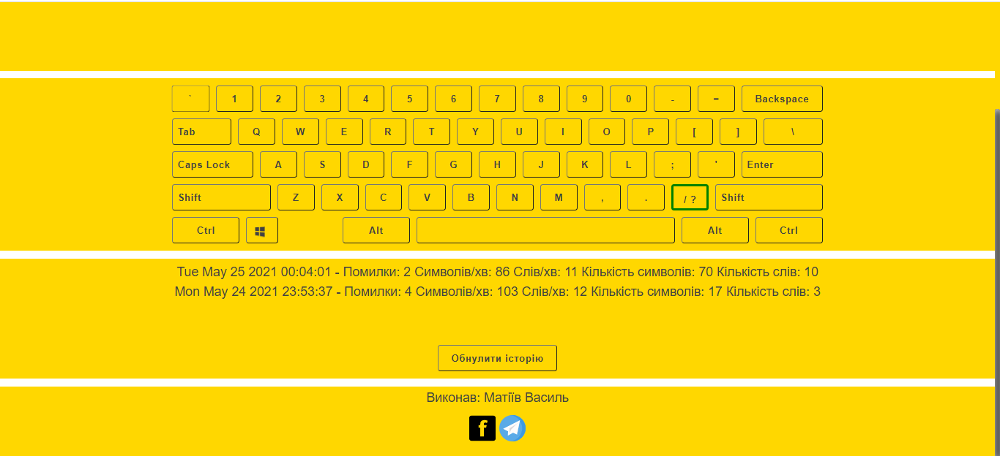

# first_project Keyboard

## Install

This project uses [node](http://nodejs.org) and [npm](https://npmjs.com). Go check them out if you don't have them locally installed.

sh
$ npm install

sh
$ npm run start

Open http://localhost:4000 to view it in the browser.

## Usage

Введіть або виберіть кількість слів і натисніть "Почати". Після цього можна розпочинати вводити текст (з великої літери на клавіатурі). Програма підрахує кількість помилок, символів, слів і символів за хвилину. Статистика зберігається в LocalStorage і її можна обнулити.

##Technologies:
JavaScript, HTML, CSS. Grid, JSON, Function and Class Components.
